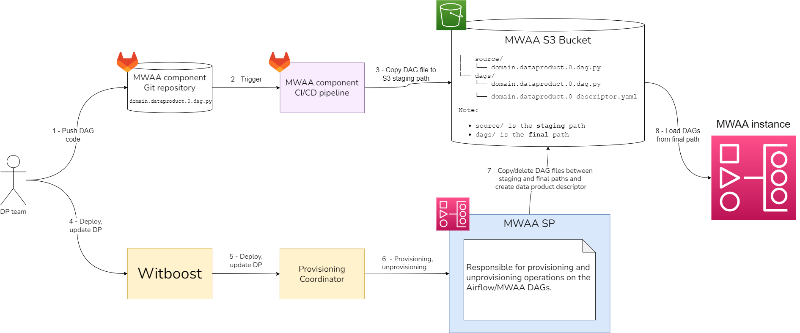
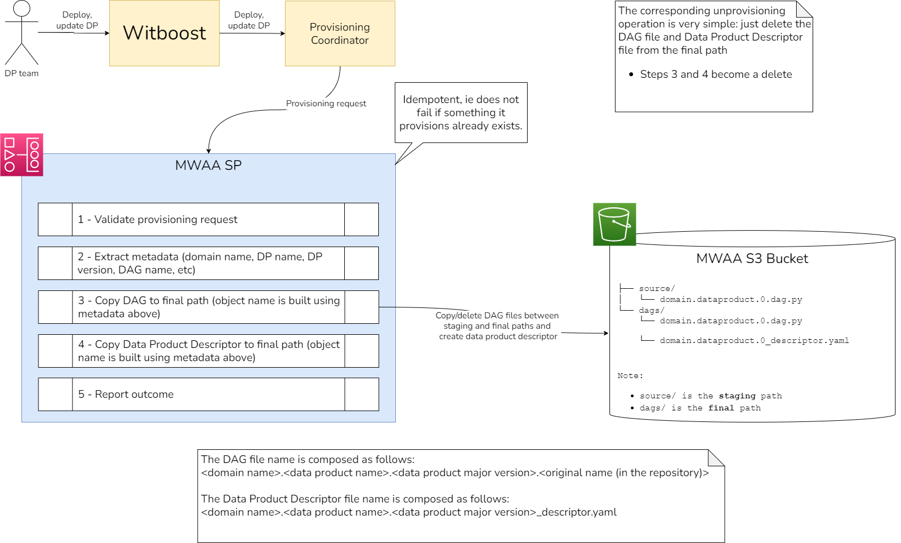

# High Level Design

This document describes the High Level Design of the Airflow/MWAA Specific Provisioner.
The source diagrams can be found and edited in the [accompanying draw.io file](hld.drawio).

## Overview

### Specific Provisioner

A Specific Provisioner (SP) is a service in charge of performing a resource allocation task, usually
through a Cloud Provider. The resources to allocate are typically referred to as the _Component_, the
details of which are described in a YAML file, known as _Component Descriptor_.

The SP is invoked by an upstream service of the Witboost platform, namely the Coordinator, which is in charge of orchestrating the creation
of a complex infrastructure by coordinating several SPs in a single workflow. The SP receives
the _Data Product Descriptor_ as input with all the components (because it might need more context) plus the id of the component to provision, named _componentIdToProvision_

To enable the above orchestration a SP exposes an API made up of five main operations:
- validate: checks if the provided component descriptor is valid and reports any errors
- provision: allocates resources based on the previously validated descriptor; clients either receive an immediate response (synchronous) or a token to monitor the provisioning process (asynchronous)
- status: for asynchronous provisioning, provides the current status of a provisioning request using the provided token
- unprovision: destroys the resources previously allocated.
- updateacl: grants access to a specific component/resource to a list of users/groups

### MWAA Specific Provisioner

This Specific Provisioner interacts with a MWAA Environment by updating objects in the corresponding S3 bucket and is able to provision Workloads (Airflow DAGs) used to orchestrate other components in the Data Product.

Every time the DAG code on the component repository is updated by the developer, a CI/CD pipeline is triggered and the DAG file is placed in a staging location with an appropriate prefix. The DAG file name is composed as follows: `<domain name>.<data product name>.<data product major version>.<original name (in the repository)>`. When the deployment of the Data Product (and hence the Workload) is triggered, the Specific Provisioner copies the DAG file from the staging directory into the final directory, where it is picked up by Airflow and loaded.

## Workload Provisioning

Workload provisioning/unprovisioning is pretty straightfoward because as stated above the main operation done in this phase is a copy (delete for unprovisioning) between the staging and final directories.

